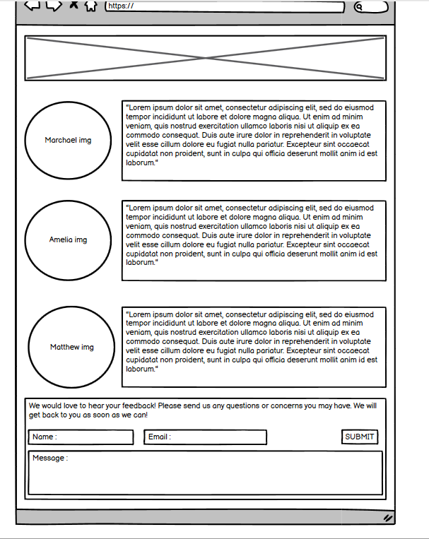
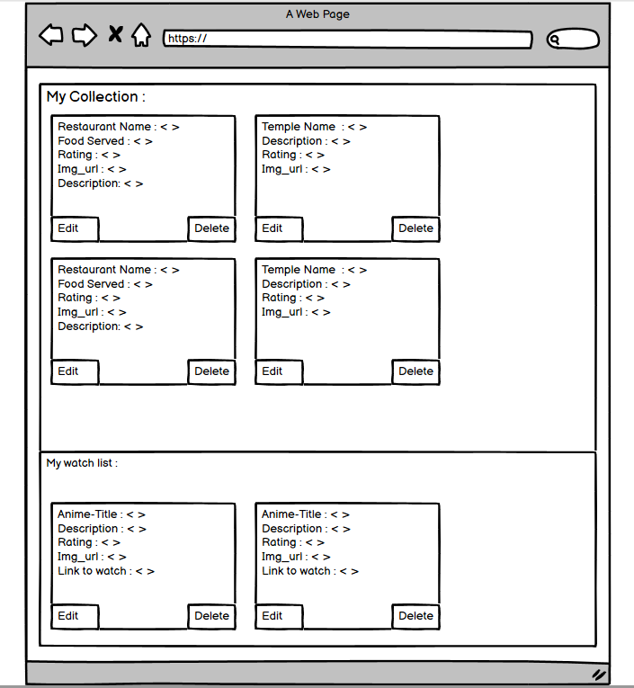
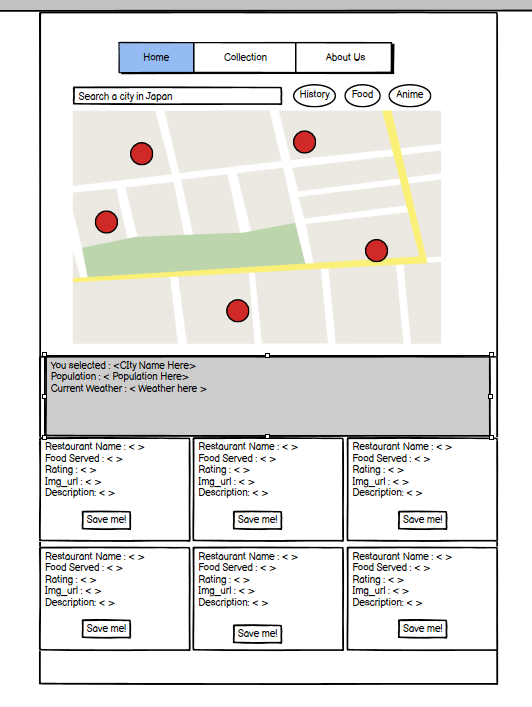
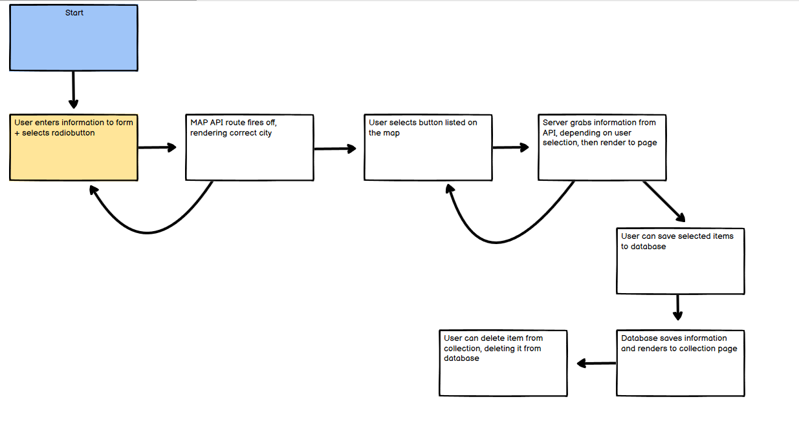
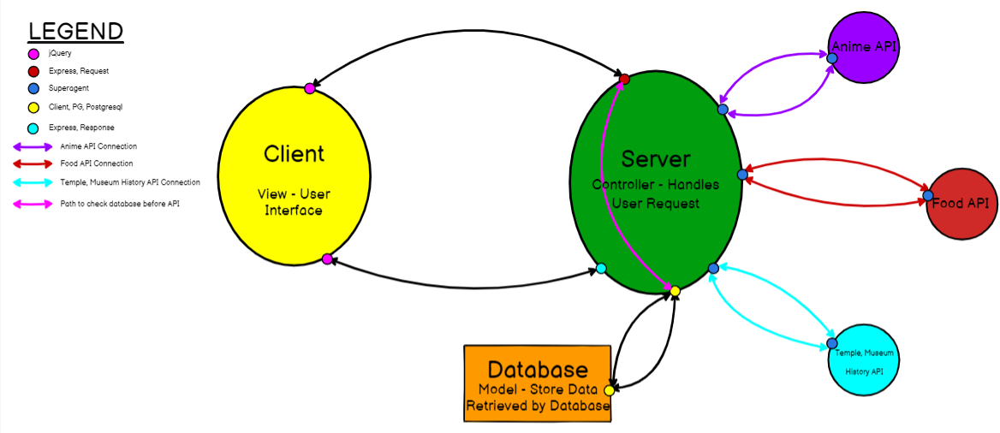
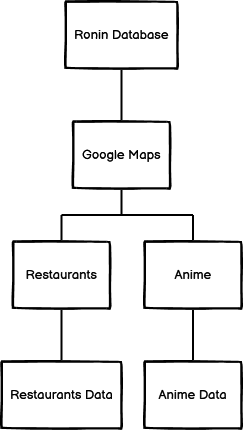

# Ronin

## Team Bulbasaur: Amelia Waggoner, Matthew Petersen, and Marchael Acode

**Author**: Amelia Waggoner, Matthew Petersen, and Marchael Acode
**Version**: 1.0.0 (increment the patch/fix version number if you make more commits past your first submission)

## Overview

- Japan travel app that provides a map of the city with points of interest that a user can click on, and get information on food/ restaurants, anime locations/ stores, and buddhist temples/ shinto shrines. Cities: Tokyo, Kyoto, Osaka, Sapporo, and Hiroshima.

## Getting Started

<!-- What are the steps that a user must take in order to build this app on their own machine and get it running? -->

## Architecture

<!-- Provide a detailed description of the application design. What technologies (languages, libraries, etc) you're using, and any other relevant design information. -->

## Change Log

<!-- Use this area to document the iterative changes made to your application as each feature is successfully implemented. Use time stamps. Here's an examples:

01-01-2001 4:59pm - Application now has a fully-functional express server, with GET and POST routes for the book resource.-->

## Team Agreement

- [Ronin Team Agreement](https://docs.google.com/document/d/1cLYBMj_HbY7EV1TanZk2TsAMRs2BtXlf7VvJZbaeyOU/edit?usp=sharing)

## User Stories

1. As a user, I want the app to show me a map, so that I can find restaurants, anime hotspots, and temples/ shrines/ historical places to visit.
  - Feature Task:
    - Shows a map of a Japanese city, and shows points of interest.
  - Acceptance Tests:Map shows up on a webpage with points of interest.
2. As a user, I want to click on the locations, and get information on them, so I can make a travel plan.
  - Feature Task:
    - Click on interest points,such as restaurants, and gets the data/ information on what you clicked to pop up below the map.
  - Acceptance Tests: The data/ information appears below map after it's clicked on.
3. As a developer, I want the app to help people find things to go see and do, so they can have a great experience in Japan.
  - Feature Task:
    - Find the city you want to look at, and be able to get information on the point of interest that’s clicked on.
  - Acceptance Tests: The map of the city appears that you choose, and you are able to see points of interest.
4. As a developer, I want to make an app that allows a user to save locations and information, so they can reference it later during or after their trip.
  - Feature Task:
    - The user can save the city, along with information on restaurants, weather, and anime information.
  - Acceptance Tests: The user is able to save and view the information that they saved.
5. As a travel agency, I want an app that gives my customers a way to look up what most interests them, while they travel, so that they know where to go in the city.
  - Feature Task:
    - Look up a city, be able to click on points of interest on a map, and save that data, so it can be viewed later.
  - Acceptance Tests: Be able to see a map with the points of interest, click on those points, and save that information for later on a separate page.

## Software Requirements

- [Ronin Software Requirements](https://docs.google.com/document/d/1L4k0TuM-_SDBirR4NTd4fPVxbBrloRrbSZw6BaF9umc/edit?usp=sharing)

## Wireframes

## Domain Modeling Diagram

## Data Entity Relationship Diagram

## Credits and Collaborations

- Shoutout to Skyler for helping with rendering Google Maps on to your homepage.
